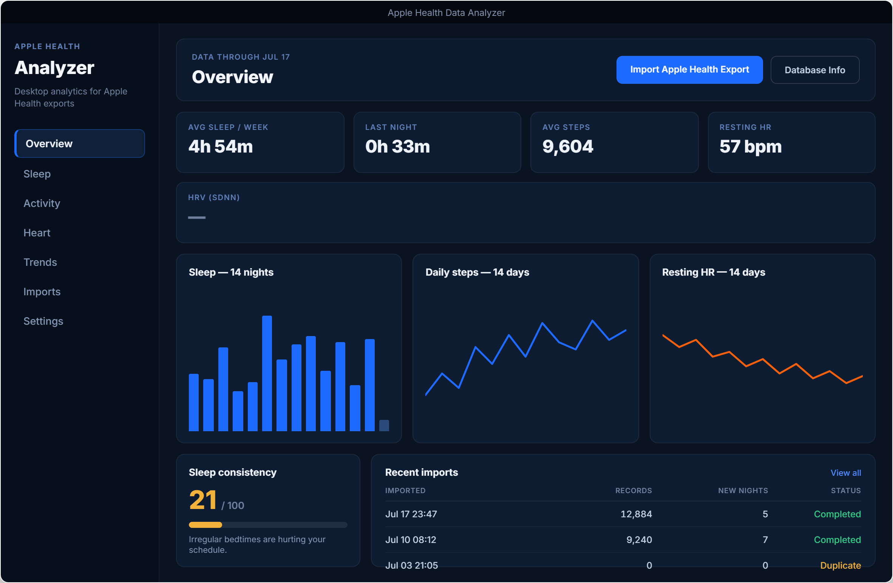

# Handoff: Overview Page — Dense "Mission Control" Layout (Option 1c)

## Overview
This package redesigns the **Overview** page of *Apple Health Data Analyzer* (a PyQt6 desktop
analytics app for Windows/Linux). The current Overview shows five KPI cards and a large empty
region below them. This redesign fills that space with a compact KPI row, a 3-up mini-chart
mosaic (sleep / steps / resting HR), a sleep-consistency gauge, and a recent-imports table —
turning dead space into an at-a-glance dashboard.

## About the Design Files
The file in this bundle (`Overview Options.dc.html`) is a **design reference created in HTML** —
a prototype showing the intended look, layout, and content. **It is not production code to copy.**
Your job is to **recreate the design labelled `1c` inside the existing PyQt6 codebase**, using the
app's established patterns: `QWidget`/`QFrame` composition, layout managers (`QVBoxLayout`,
`QHBoxLayout`, `QGridLayout`), and the existing QSS theme. Match the existing app's widget
structure and naming conventions — do not introduce a web view or a new UI framework.

The HTML file contains three options (`1a`, `1b`, `1c`) laid out side by side. **Implement `1c`
only** (the rightmost / dense option). The others are context.

## Fidelity
**High-fidelity.** Colors, typography, spacing, and layout below are final and exact. Recreate
the layout pixel-faithfully with PyQt6 widgets + QSS. Charts may be drawn with `QPainter`,
`QtCharts`, or `pyqtgraph` — whichever the codebase already uses (see "Charts" below).

---

## Screen: Overview (dense dashboard)

### Page frame
- App uses a **left sidebar (≈210px) + main content area** split. Do not change the sidebar.
- Main content area: background `#0a1322`, padding `20px 22px`, vertical stack (`QVBoxLayout`)
  with `14px` spacing between the four regions below, top to bottom:
  1. Header bar
  2. KPI row (5 cards)
  3. Chart mosaic (3 columns, stretches to fill)
  4. Bottom row: consistency gauge + recent-imports table (fixed height ≈150px)

### Region 1 — Header bar
- A `QFrame` "card": background `#0d1a2e`, border `1px solid rgba(255,255,255,0.06)`,
  border-radius `11px`, padding `17px 20px`. `QHBoxLayout`, space-between.
- Left, stacked:
  - Eyebrow: `DATA THROUGH JUL 17` — 10px, weight 600, letter-spacing `0.09em`, uppercase,
    color `#5f80b8`, `7px` below it the title.
  - Title: `Overview` — 23px, weight 800, color `#f3f7fc`, letter-spacing `-0.01em`.
- Right: two buttons in a row, `10px` gap:
  - **Primary** `Import Apple Health Export`: background `#1e6bff`, text `#ffffff`, 12px/600,
    padding `10px 18px`, radius `8px`.
  - **Secondary** `Database Info`: transparent, border `1px solid rgba(255,255,255,0.14)`,
    text `#c3d0e4`, 12px/600, padding `10px 18px`, radius `8px`.

### Region 2 — KPI row (5 cards)
- `QHBoxLayout`, `12px` gap, each card stretches equally (min-width ~150px).
- Card = `QFrame`: background `#0e1c31`, border `1px solid rgba(255,255,255,0.06)`,
  radius `10px`, padding `13px 15px`. Stacked contents:
  - **Key** (label): 10px, weight 600, letter-spacing `0.09em`, uppercase, color `#5f80b8`,
    `9px` below it the value.
  - **Value**: 23px, weight 800, color `#eef3fa`, letter-spacing `-0.01em`.
- The five cards, in order (label → value):
  1. `AVG SLEEP / WEEK` → `4h 54m`
  2. `LAST NIGHT` → `0h 33m`
  3. `AVG STEPS` → `9,604`
  4. `RESTING HR` → `57 bpm`
  5. `HRV (SDNN)` → `—`  (em-dash, colored `#6f819e` for the "no data" state)

### Region 3 — Chart mosaic (3 equal columns)
- `QGridLayout` or `QHBoxLayout`, 3 equal columns, `14px` gap, **stretches to fill vertical space**.
- Each panel = `QFrame`: background `#0e1c31`, border `1px solid rgba(255,255,255,0.06)`,
  radius `11px`, padding `15px 16px`. Panel title at top: 13px, weight 700, color `#eef3fa`,
  `12px` below it the chart, which fills the rest of the panel.
- **Panel A — "Sleep — 14 nights"**: vertical **bar chart**, 14 bars, `6px` gap, bars colored
  `#1e6bff`, radius `2px` on top corners. The final (most recent) bar is a stub (~8% height)
  colored `#2a4a7a` to signal a partial/short night.
- **Panel B — "Daily steps — 14 days"**: **line chart**, single polyline, stroke `#1e6bff`,
  width `2.5px`, round joins/caps, no fill.
- **Panel C — "Resting HR — 14 days"**: **line chart**, single polyline, stroke `#f2600c`
  (accent orange), width `2.5px`, round joins/caps, no fill.

### Region 4 — Bottom row (gauge + table), fixed height ≈150px
- `QHBoxLayout`, `14px` gap. Left panel fixed width `210px`; right panel stretches.
- **Left — Sleep consistency gauge** (`QFrame`, same card style, padding `15px 16px`,
  contents space-between):
  - Title `Sleep consistency` — 13px/700, `#eef3fa`.
  - Score row: big number `21` (34px, weight 800, color `#f2b23c` amber) + ` / 100`
    (13px/600, `#6f819e`).
  - Progress bar: track `rgba(255,255,255,0.08)`, height `8px`, radius `4px`; fill 21% wide,
    color `#f2b23c`, radius `4px`.
  - Caption: `Irregular bedtimes are hurting your schedule.` — 11px/400, `#8397b4`.
- **Right — Recent imports table** (`QFrame`, card style, padding `15px 18px`):
  - Header row: title `Recent imports` (13px/700, `#eef3fa`) + right-aligned link
    `View all` (11px/500, `#4f8dff`).
  - Table: 4 columns with weights `1.3 / 1 / 1 / 0.8`. Column headers (9.5px, weight 600,
    letter-spacing `0.05em`, uppercase, `#6f819e`), separated from body by a
    `1px solid rgba(255,255,255,0.07)` bottom border:
    `IMPORTED` · `RECORDS` (right) · `NEW NIGHTS` (right) · `STATUS` (right).
  - Body rows: 12px/500, `#c3d0e4`, numeric columns right-aligned and tabular
    (`font-variant-numeric: tabular-nums` → in Qt set the font style hint / use a
    monospace-digit font or `QFont::setStyleHint`). Row separators
    `1px solid rgba(255,255,255,0.04)`. Status cell colored by value.
  - Rows (Imported / Records / New nights / Status):
    1. `Jul 17 23:47` · `12,884` · `5` · `Completed` (status color `#34c884` green)
    2. `Jul 10 08:12` · `9,240` · `7` · `Completed` (`#34c884`)
    3. `Jul 03 21:05` · `0` · `0` · `Duplicate` (status color `#f2b23c` amber)

---

## Data requirements (maps to MariaDB rollups)
Everything on the page reads from existing rollup tables — no per-sample queries needed.

| Widget | Source | Query shape |
|---|---|---|
| Avg sleep / week | sleep nights | AVG(duration) over latest 7 nights |
| Last night | sleep nights | latest night duration + efficiency |
| Avg steps | daily summaries | AVG(steps) over latest 7 summaries |
| Resting HR | daily summaries / HR rollup | latest resting HR value + date |
| HRV (SDNN) | HR rollup | latest SDNN; render `—` when NULL |
| Sleep bars (14) | sleep nights | last 14 nights, duration each |
| Steps line (14) | daily summaries | last 14 days, steps each |
| Resting HR line (14) | daily summaries | last 14 days, resting HR each |
| Consistency (0–100) | sleep nights | app's existing consistency metric, else stdev of bedtimes normalized |
| Recent imports | imports | last N imports: timestamp, record count, new-nights count, status |

**Empty/partial states:** any KPI with no data renders `—` in `#6f819e`. If a chart has fewer
than 14 points, left-pad with gaps (don't stretch). If there are no imports, show a single
muted row `No imports yet`.

---

## Design Tokens

### Colors
| Token | Hex | Use |
|---|---|---|
| Canvas | `#0a1322` | main content background |
| Card | `#0e1c31` | chart / gauge / table panels |
| Card (header/banner) | `#0d1a2e` | header bar, KPI cards use `#0e1c31` |
| Sidebar | `#080f1c` | left nav (unchanged) |
| Primary / accent-blue | `#1e6bff` | primary button, sleep bars, steps line, active nav |
| Accent-orange | `#f2600c` | resting-HR line, alert emphasis |
| Success green | `#34c884` | "Completed" status, positive deltas |
| Warning amber | `#f2b23c` | consistency gauge, "Duplicate" status |
| Bar stub | `#2a4a7a` | partial/most-recent sleep bar |
| Text strong | `#f3f7fc` | page title |
| Text primary | `#eef3fa` | KPI values, panel titles |
| Text body | `#c3d0e4` | table body |
| Text muted | `#8397b4` | captions, secondary |
| Text label | `#5f80b8` | eyebrow / KPI labels |
| Text faint | `#6f819e` | no-data dash, `/100`, column headers |
| Border | `rgba(255,255,255,0.06)` | card borders |
| Border faint | `rgba(255,255,255,0.04)` | table row separators |
| Border header | `rgba(255,255,255,0.07)` | table header underline |
| Button-2 border | `rgba(255,255,255,0.14)` | secondary button |

### Typography
- Family: **Inter** (fallback system sans). If Inter isn't bundled, use the app's current UI font.
- Scale (px / weight): eyebrow 10/600 · label 10/600 · KPI value 23/800 · title 23/800 ·
  panel title 13/700 · gauge number 34/800 · table body 12/500 · table header 9.5/600 ·
  caption 11/400.
- Letter-spacing: eyebrows/labels `+0.09em`, table headers `+0.05em`, big titles/numbers `-0.01em`.

### Spacing / radius
- Region gap `14px`; KPI/mosaic gap `12–14px`; card padding `13–17px`.
- Radius: cards `10–11px`, buttons `8px`, progress bar `4px`, bar-chart bar tops `2px`.
- Bottom row height ≈ `150px`; sidebar `210px`; gauge panel `210px`.

### Shadows/borders
- No drop shadows inside the content area. Depth comes from `1px` translucent borders + the
  card fill being lighter than the canvas.

---

## PyQt6 implementation notes
- Build each region as a small `QFrame` subclass with a QSS `objectName` (e.g. `#kpiCard`,
  `#chartPanel`, `#gaugePanel`, `#importsTable`) so styling stays in the QSS theme, matching the
  existing app.
- Use `QGridLayout` for the mosaic with equal column stretch (`setColumnStretch(i, 1)`) and set
  `layout.setContentsMargins` / `setSpacing` to the token values.
- **Charts:** reuse whatever the Sleep/Heart pages already use. If that's `QPainter`-drawn,
  subclass `QWidget` and override `paintEvent` (bars: `drawRoundedRect`; lines:
  `drawPolyline` with `QPen` width 2.5, `Qt.RoundCap`/`Qt.RoundJoin`). If it's `pyqtgraph`,
  configure `PlotWidget` with `background=None`, hide axes for the mini-charts, set pen colors
  from the tokens.
- Right-aligned tabular numbers: set the cell `QLabel` alignment `Qt.AlignRight` and a font with
  `QFont.StyleHint.TypeWriter` (or use a digit-monospaced font) so columns line up.
- Status-cell color: set per-row via a property + QSS selector, or `setStyleSheet` on the label.
- Keep the header buttons wired to the existing import / DB-info actions — don't create new ones.

---

## Files
- `Overview Options.dc.html` — the HTML design reference. Open in a browser; implement the `1c`
  (rightmost) option. Ignore `1a` and `1b`.
- `overview_1c.png` — rendered screenshot of the `1c` layout (the target to match).

## Screenshot

## Assets
No image assets. All visuals are CSS/SVG (charts, gauge, progress bar) — recreate with QPainter /
the app's charting library. Icons: none required beyond what the existing nav already uses.
